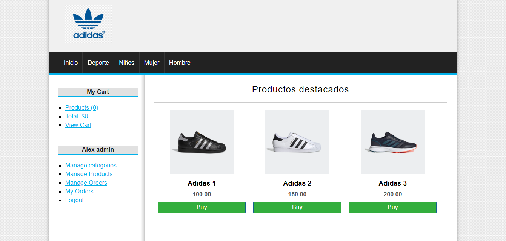

# Ecommerce con PHP y MySQL
Ecommerce con PHP y MySQL.

Tecnologías:
- PHP.
- MySQL.

Esta app puede:
- Productos: Crear/Leer/Actualizar/Eliminar.
- Categorías: Crear/Leer/Actualizar/Eliminar.
- Carrito: Crear/actualizar/finalizar
- Usuario: Permite registrar e iniciar sesión
- y más.

# Screenshot

# Guía de instalación
1. Descarga el repositorio.
2. Descomprime la carpeta dentro del directorio que desees(Laragon, Valet, Xampp o WampServer).
3. Renombra la carpeta (Opcional).
4. Define los datos de conexión.
5. Abre la aplicación en el navegador con `http://localhost:tu-puerto/index.php`.
6. Registra un nuevo usuario y ya puedes comenzar a utilizar la aplicación.

# License

#### Todos los proyectos creados por Alex Ku Dzul están bajo la [licencia MIT](https://opensource.org/licenses/MIT).